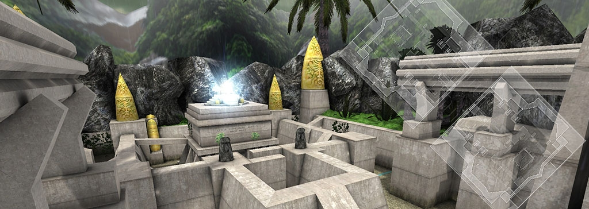
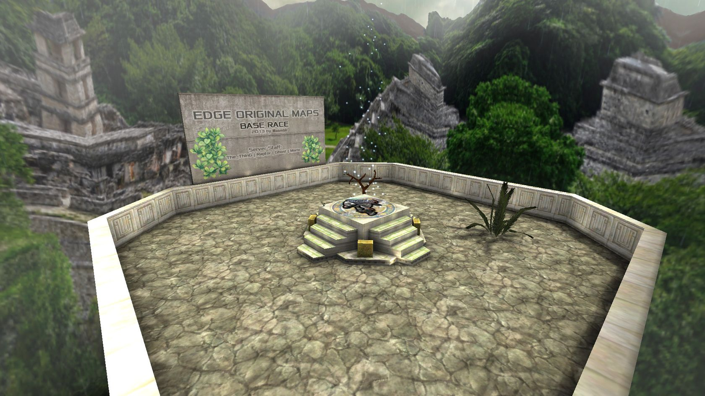
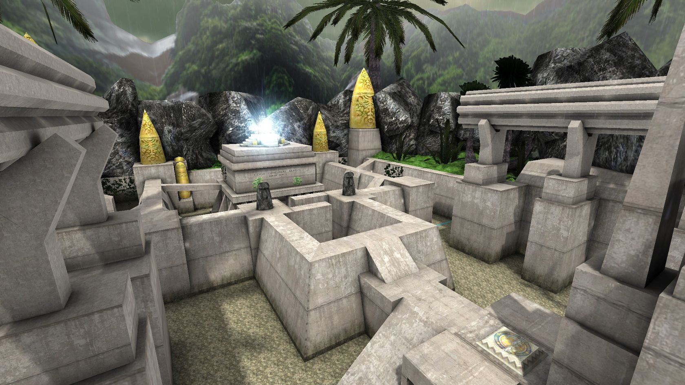
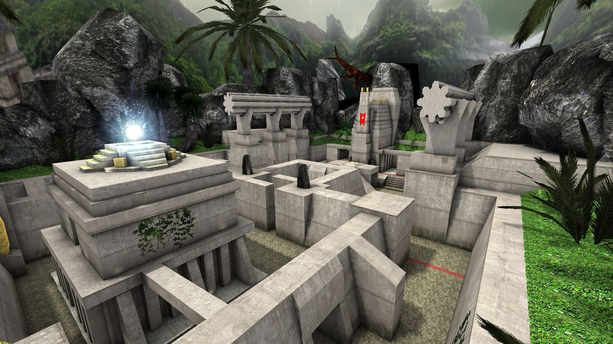
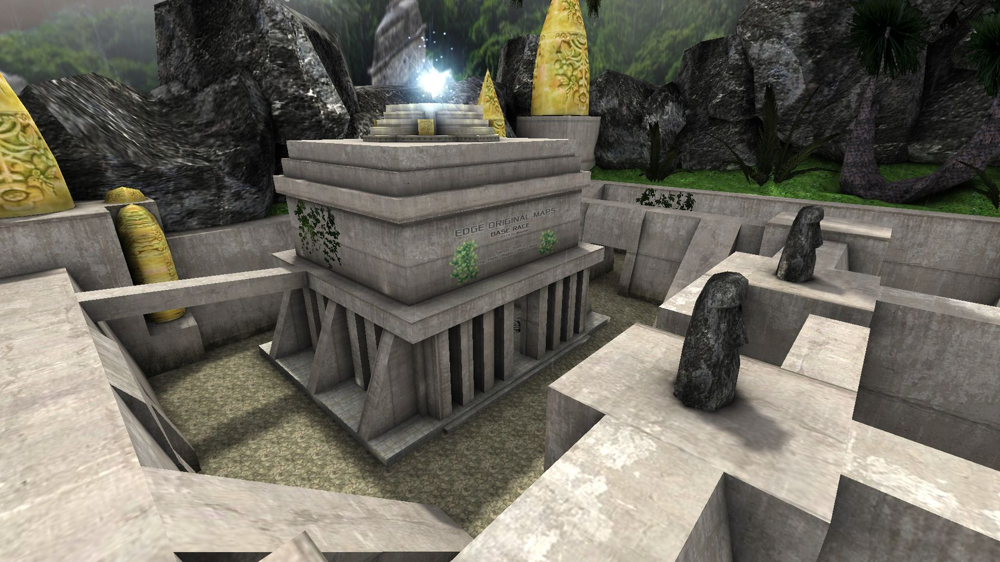
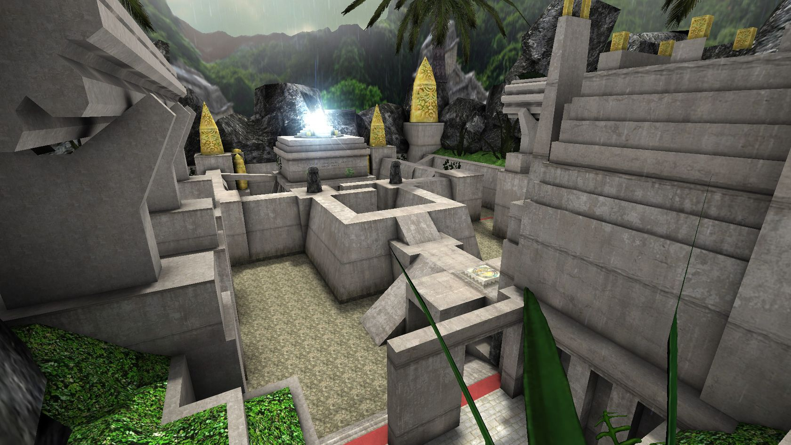
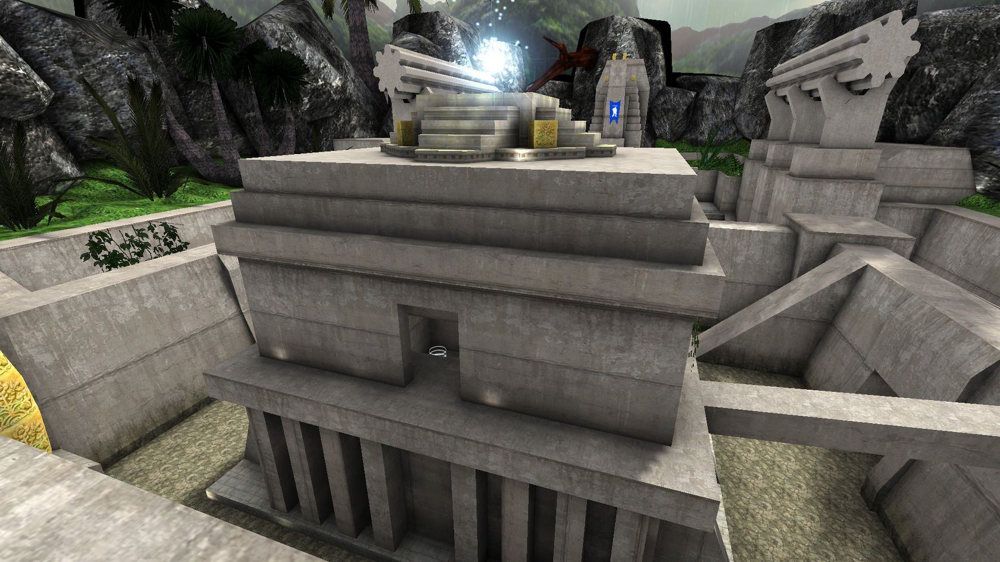
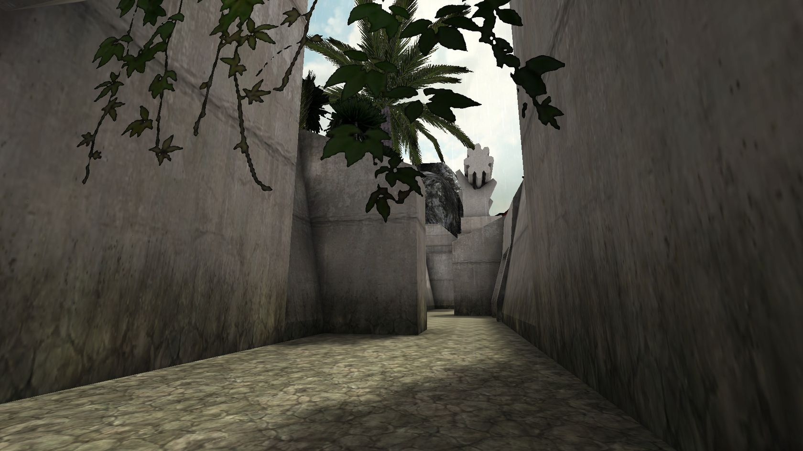
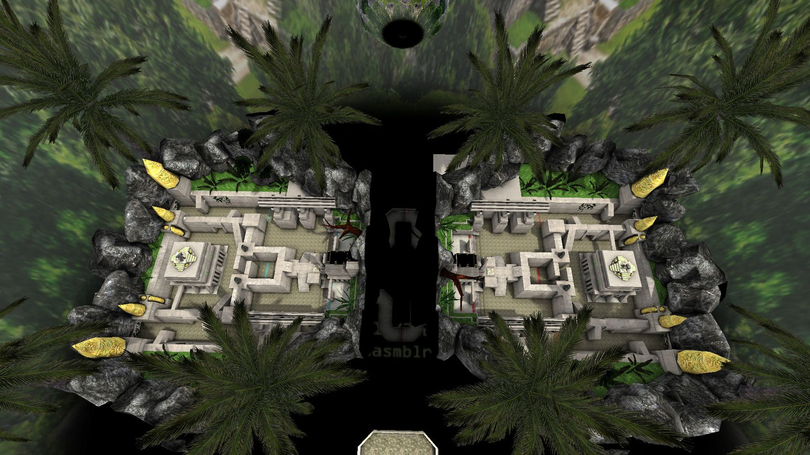

# Baserace - Game Level For Tremulous
 

## Overview: Original Edge Map

Baserace is a game level by Matthias "Masmblr" Peters for the open source game [_Tremulous_](https://tremulous.net/).

Map Description: 
> The design of this level is reminiscent of an ancient Inka site in Central America. The primary concept revolves around both teams navigating through 2 connecting tunnels and 2 teleport-pads.
 
* * *

## Screenshots:
[](meta/preview_levelshots/1.jpg)
[](meta/preview_levelshots/2.jpg)
[](meta/preview_levelshots/3.jpg)
[](meta/preview_levelshots/4.jpg)
[](meta/preview_levelshots/5.jpg)
[](meta/preview_levelshots/6.jpg)
[](meta/preview_levelshots/7.jpg)
[](meta/preview_levelshots/8.jpg)

## Version History:
| Version: | Date:        | Status: |
| ------- | ------------- | ------: |
| 1.0     | 01/02/2013 | beta |
| 2.0     | 16/02/2013  | beta |
| 3.0     | 26/02/2013  | release |

## How-To
**Binary**:
1. Download the release package.
2. Save the *.pk3 file to the following directory: `/%PATH%/Tremulous/base/`.
3. Start the Tremulous game and select "Create Server" with the desired map.

**Source**:
1. Download the [source release](https://github.com/Masmblr/map-Baserace_src/releases/) and the [tremulous-common-files](https://github.com/Masmblr/tremulous-map-common/releases/tag/v1.0).
2. Extract the files to the default installation directory. It should look like this:

```
DRIVE:/%PATH%/tremulous/
|   tremulous.exe
|   tremulous.x86
|   ...
+---base
|   |   autogen.cfg
|   |   data-1.1.0.pk3
|   |   map-atcs-1.1.0.pk3
|   |   ...
|   +---env
|   +---maps 
|   +---models 
|   +---scripts
|   +---sounds
|   \---textures
```
1. Download [NetRadiant Level Editor](https://netradiant.gitlab.io/page/download/).
2. Launch NetRadiant and select "Tremulous" as your game setting.
3. Open the '.map' file located in the directory `/%PATH%/tremulous/base/maps` and, from the menu, choose 'Build -> 'Build with final settings.'
4. Start the Tremulous game with `-sv_pure 0 -devmap MAPNAME`. Make sure to replace "MAPNAME" with the actual name of the map you compiled.

## Development Tools:
Photoshop CS6 \
[Audacity](https://www.audacityteam.org/) \
[NetRadiant](https://netradiant.gitlab.io/) \
[Q3Map2](http://q3map2.robotrenegade.com/)

## Related Resources:
Official Tremulous website: https://tremulous.net </br>
NET Radiant Level-Editor: https://netradiant.gitlab.io </br>
Master-Server-List: http://dpmaster.deathmask.net/?game=tremulous </br>
Unofficial successor "Unvanquished": https://unvanquished.net

## Legal Information and Attribution
Some assets may be derivative works or subject to different licenses. Please refer for author and license details. Note that some files may have been modified. Below is a list of files and their legal statuses.

***
levelshots\baserace.jpg <sup>[1](#Credit-1)</sup> \
maps\baserace.map <sup>[1](#Credit-1)</sup> \
models\mapobjects\horizon.md3 <sup>[1](#Credit-1)</sup> \
scripts\baserace.arena <sup>[1](#Credit-1)</sup> \
scripts\baserace.particle <sup>[1](#Credit-1)</sup> \
scripts\baserace.shader <sup>[1](#Credit-1)</sup> \
scripts\shaderlist.txt <sup>[1](#Credit-1)</sup> \
textures\baserace\nature_wood_06.jpg <sup>[1](#Credit-1)</sup> \
textures\baserace\nature_wood_07.jpg <sup>[1](#Credit-1)</sup> \
textures\baserace\sfx_flare_01.jpg <sup>[1](#Credit-1)</sup> \
textures\baserace\sfx_gears_01.tga <sup>[1](#Credit-1)</sup> \
textures\baserace\sfx_gold_glossy.jpg <sup>[1](#Credit-1)</sup> \
textures\baserace\sfx_rain_01.tga <sup>[1](#Credit-1)</sup> \
textures\baserace\sfx_sky_horizon_01.tga <sup>[1](#Credit-1)</sup> \
textures\baserace\sfx_sky_horizon_02.tga <sup>[1](#Credit-1)</sup> \
textures\baserace\sfx_sky_horizon_03.tga <sup>[1](#Credit-1)</sup> \
textures\baserace\sfx_sky_horizon_04.tga <sup>[1](#Credit-1)</sup> \
textures\baserace\sfx_sky_horizon_05.tga <sup>[1](#Credit-1)</sup> \
textures\baserace\sfx_smoke_01.tga <sup>[1](#Credit-1)</sup> \
textures\baserace\stone_cliff_01.jpg <sup>[1](#Credit-1)</sup> \
textures\baserace\stone_cliff_02.jpg <sup>[1](#Credit-1)</sup> \
textures\baserace\stone_cliff_03.jpg <sup>[1](#Credit-1)</sup> \
textures\baserace\temple_floor_portal_02.jpg <sup>[1](#Credit-1)</sup> \
textures\baserace\temple_floor_portal_03.jpg <sup>[1](#Credit-1)</sup> \
textures\baserace\temple_outside_floor_01.jpg <sup>[1](#Credit-1)</sup> \
textures\baserace\temple_outside_info.jpg <sup>[1](#Credit-1)</sup> \
textures\baserace\temple_outside_wall_02.jpg <sup>[1](#Credit-1)</sup> \
textures\baserace\temple_outside_wall_03.jpg <sup>[1](#Credit-1)</sup> \
textures\baserace\temple_outside_wall_04.jpg <sup>[1](#Credit-1)</sup> \
textures\baserace\temple_sign_03.tga <sup>[1](#Credit-1)</sup> \
textures\baserace\temple_sign_04.tga <sup>[1](#Credit-1)</sup> \
textures\baserace\temple_team_01.jpg <sup>[1](#Credit-1)</sup> \
textures\baserace\temple_team_02.jpg <sup>[1](#Credit-1)</sup> \
textures\baserace\temple_team_03.jpg <sup>[1](#Credit-1)</sup>
***

### Credit-1
[Matthias "Masmblr" Peters](mailto:masmblr@gmail.com) \
Content: Map, Textures, Shaders \
License: [MIT License](https://opensource.org/license/mit/).
(See "LICENSE" file for more Informations.)

For all other content, their respective licensing rules and other legal provisions apply.

## Special Thanks:
* id Software for Quake3
* Dark Legion Development for Tremulous
* Team Xonotic for NetRadiant 
